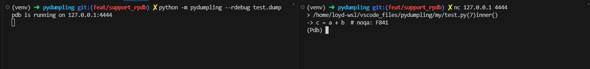

# 针对Python的异常调试器

这是 [elifiner/pydump](https://github.com/elifiner/pydump) 的fork/优化版本, 主要优化点有:
* 支持在任何地方保存`Python traceback`，而不是只在异常发生的时候
* 优化代码结构, 去除冗余代码
* 修复其在3.10+版本中的bug
* 支持更多的pdb命令
* 提供了一个方便用来调试的命令行工具
* 支持服务器远程调试(remote pdb)

pydumpling可以在代码的任何位置中，将当前Python程序的traceback写到一个文件中，可以稍后在Python调试器中加载它。目前pydump支持很多兼容PDB api的调试器（pdbpp, udb, ipdb)

## 为什么会有Pydump?

* 我们在日常代码编写中，通常都会用`try ... except ...`去捕获程序中出现的异常，但是我们真的知道这些异常出现的原因吗?
* 当你的项目在线上运行时，突然出现了不符合预期的异常导致进程退出，你应该怎样去复现当时的异常现场？
* 日志中没有足够的信息帮助我们去准确定位线上问题？
* 如果我们能够把线上的异常现场保存下来，然后通过调试器去恢复当时的异常堆栈，我们可以看到这个异常的整条调用链路以及链路上的堆栈变量，就如同你在本地断点捕获到了这个异常一样。

## 安装方法
Python版本支持：>=3.7

```
pip install -i pydumpling
```

## 使用方法

### 在任何地方进行`traceback`的保存
```python
from pydumpling import dump_current_traceback
from inspect import currentframe


def inner():
    a = 1
    b = "2"
    dump_current_traceback("test.dump")
    c = str(a) + b


def outer():
    d = 4
    inner()

```


### 在异常发生时进行异常堆栈的保存
在异常捕获的处理代码中使用`save_dumpling()`. 如果不指定文件名，默认使用：`${exception file}:${line number of the exception}.dump`.

```python
from pydumpling import save_dumping

def inner():
    a = 1
    b = "2"
    c = a + b


def outer():
    inner()


if __name__ == "__main__":
    try:
        outer()
    except Exception:
        save_dumping("test.dump")

```

这样我们就得到了当时异常`traceback`的`dump文件`，通过`debub_dumpling`即可对其进行pdb调试：

```python     
Python 3.10.6 (main, Aug  1 2022, 20:38:21) [GCC 5.4.0 20160609] on linux
Type "help", "copyright", "credits" or "license" for more information.
>>> from pydumpling import debug_dumpling
>>> debug_dumpling("test.dump")
> /home/loyd/vscodeFiles/pydumpling/test.py(6)inner()
-> c = a + b
(Pdb) list 1,17
  1     from pydumpling import save_dumping
  2  
  3     def inner():
  4  >>     a = 1
  5         b = "2"
  6  ->     c = a + b
  7  
  8  
  9     def outer():
 10         inner()
 11  
 12  
 13     if __name__ == "__main__":
 14         try:
 15             outer()
 16         except Exception:
 17             save_dumping("test.dump")
(Pdb) ll
  3     def inner():
  4  >>     a = 1
  5         b = "2"
  6  ->     c = a + b
(Pdb) bt
  /home/loyd/vscodeFiles/pydumpling/test.py(15)<module>()
-> outer()
  /home/loyd/vscodeFiles/pydumpling/test.py(10)outer()
-> inner()
> /home/loyd/vscodeFiles/pydumpling/test.py(6)inner()
-> c = a + b
(Pdb) pp a
1
(Pdb) pp b
'2'
(Pdb) u
> /home/loyd/vscodeFiles/pydumpling/test.py(10)outer()
-> inner()
(Pdb) ll
  9     def outer():
 10  ->     inner()
(Pdb) 
```

### 命令行使用

#### 使用命令行来打印traceback:
`python -m pydumpling --print test.deump`

将会输出:
```python
Traceback (most recent call last):
  File "/workspaces/pydumpling/tests/test_dump.py", line 20, in test_dumpling
    outer()
  File "/workspaces/pydumpling/tests/test_dump.py", line 14, in outer
    inner()
  File "/workspaces/pydumpling/tests/test_dump.py", line 10, in inner
    c = a + b  # noqa: F841
TypeError: unsupported operand type(s) for +: 'int' and 'str'
```


#### 使用命令行来进行pdb调试:
`python -m pydumpling --debug test.deump`

将会打开pdb调试会话:
```python
-> c = a + b
(Pdb) 
```

#### 使用命令行来进行remote pdb调试
`python -m pydumpling --rdebug test.deump`
它会在机器的4444端口上打开pdb调试器，然后我们可以在另外一台机器上使用telnet、netcat来进行远程调试：
`nc 127.0.0.1 4444`


## TODO
- []
