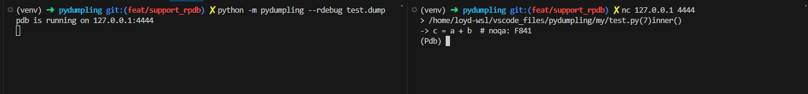

Tutorial
=========

Save the python traceback anywhere
-----------------------------------

.. code-block:: python

    from pydumpling import dump_current_traceback

    def inner():
        a = 1
        b = "2"
        dump_current_traceback("test.dump")
        c = str(a) + b

    def outer():
        d = 4
        inner()

    outer()

Save the exception traceback
----------------------------
.. code-block:: python

    from pydumpling import save_dumping

    def inner():
        a = 1
        b = "2"
        c = a + b

    def outer():
        inner()

    if __name__ == "__main__":
        try:
            outer()
        except Exception:
            save_dumping("test.dump")

Use ``debug_dumpling`` to do pdb debug
--------------------------------------

.. code-block:: console

    Python 3.10.6 (main, Aug  1 2022, 20:38:21) [GCC 5.4.0 20160609] on linux
    Type "help", "copyright", "credits" or "license" for more information.
    >>> from pydumpling import debug_dumpling
    >>> debug_dumpling("test.dump")
    > /home/loyd/vscodeFiles/pydumpling/test.py(6)inner()
    -> c = a + b
    (Pdb) list 1,17
      1     from pydumpling import save_dumping
      2
      3     def inner():
      4  >>     a = 1
      5         b = "2"
      6  ->     c = a + b
      7
      8
      9     def outer():
     10         inner()
     11
     12
     13     if __name__ == "__main__":
     14         try:
     15             outer()
     16         except Exception:
     17             save_dumping("test.dump")
    (Pdb) ll
      3     def inner():
      4  >>     a = 1
      5         b = "2"
      6  ->     c = a + b
    (Pdb) bt
      /home/loyd/vscodeFiles/pydumpling/test.py(15)<module>()
    -> outer()
      /home/loyd/vscodeFiles/pydumpling/test.py(10)outer()
    -> inner()
    > /home/loyd/vscodeFiles/pydumpling/test.py(6)inner()
    -> c = a + b
    (Pdb) pp a
    1
    (Pdb) pp b
    '2'
    (Pdb) u
    > /home/loyd/vscodeFiles/pydumpling/test.py(10)outer()
    -> inner()
    (Pdb) ll
      9     def outer():
     10  ->     inner()
    (Pdb)

Use command line
----------------

help message

.. code-block:: console

    python -m pydumpling --help

.. code-block:: text

    usage: pydumpling [options] filename

    pydumpling cli tools

    positional arguments:
      filename    the .dump file

    options:
      -h, --help  show this help message and exit
      --print     print traceback information
      --debug     enter pdb debugging interface

Print the traceback
###################

Use ``pydumpling --print test.dump`` to print the traceback information.

It will print the following information:

.. code-block:: text

    Traceback (most recent call last):
    File "/workspaces/pydumpling/tests/test_dump.py", line 20, in test_dumpling
      outer()
    File "/workspaces/pydumpling/tests/test_dump.py", line 14, in outer
      inner()
    File "/workspaces/pydumpling/tests/test_dump.py", line 10, in inner
      c = a + b  # noqa: F841
    TypeError: unsupported operand type(s) for +: 'int' and 'str'

Do pdb debug with dump file
############################

Use ``pydumpling --debug test.deump`` to do pdb debugging with dump file.

It will open the pdb window:

.. code-block:: text

    -> c = a + b
    (Pdb)

Do remote debug with dump file
##############################
Use ``python -m pydumpling --rdebug test.dump`` to do remote debug.
It will open the debugger on port 4444, then we can access pdb using `telnet`_, `netcat`_ .

.. _telnet: https://en.wikipedia.org/wiki/Telnet#Modern_day_uses
.. _netcat: https://netcat.sourceforge.net/

